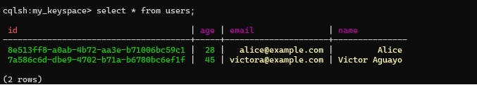

# Rust and ScyllaDB

### This example assumes that ScyllaDB is dockerized and listening on 127.0.0.1:9042.

### Technologies
[](https://skillicons.dev)

### Site ScyllaDB
- [https://www.scylladb.com/](https://www.scylladb.com/)

-------------------------------------------------------------

#### Connecting to ScyllaDB in Docker:
```
docker exec -it scylla cqlsh
```

#### Create a keyspace:
```
CREATE KEYSPACE my_keyspace
WITH replication = {'class': 'SimpleStrategy', 'replication_factor': 1};
USE my_keyspace;
```

#### Create a table:
```
CREATE TABLE users (
    id UUID PRIMARY KEY,
    name text,
    age int,
    email text
);
```

#### Insert data:
```
INSERT INTO users (id, name, age, email)
VALUES (uuid(), 'Alice', 28, 'alice@example.com');
```

1. To run the example we need to first build the examples using the following command:


```bash
cargo build 
```

<!-- END_STEP -->

2. Run the example with dapr using the following command:


```bash
cargo run
```

<!-- END_STEP -->

If everything went well you should see the following output:




